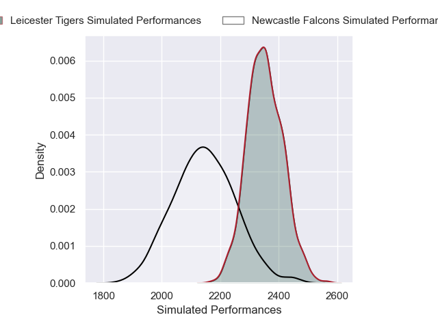
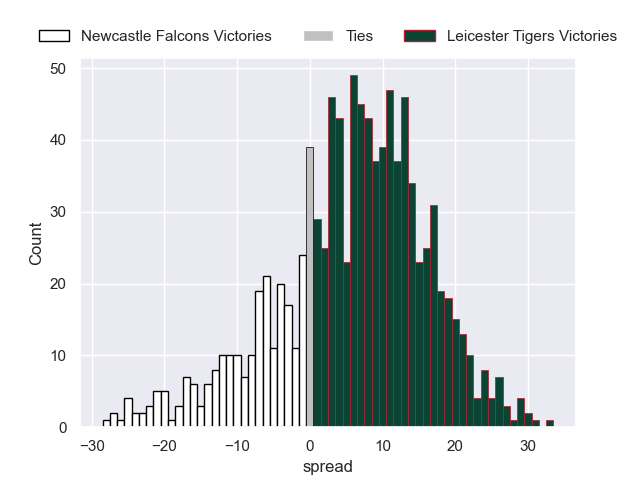

---  
layout: page  
title: Newcastle Falcons V Leicester Tigers on 2025/10/31  
date: 2025-10-31  
categories: "Premiership Rugby Cup 25/26" match projection  
---
# Newcastle Falcons V Leicester Tigers on 2025/10/31, 8.0 to 10.0

# Club Level Predictions

Now that the game has been played, lets see how the club predictions did. I predicted Leicester Tigers to win by 5.0, and Leicester Tigers won by 2.0. That's an absolute error of 3.0 for the margin of victory, while my average absolute error has been 13.9 over the past six months. This prediction was more accurate than 85.1% of my recent predictions.

For the Over/Under model, I predicted a total of 67.5 and we have an actual total of 18.0. That's an absolute error of 49.5 compared to a six month average of 13.4. This prediction was more accurate than 1.0% of my recent predictions.
## Projected Performances - Club Model

## Projected Spreads - Club Model

## Projected Results - Club Model

