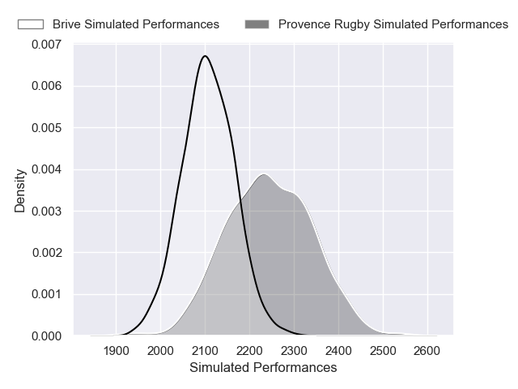
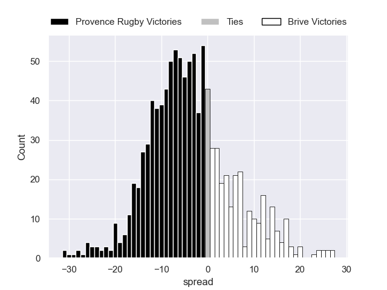

---  
layout: page  
title: Provence Rugby V Brive on 2025/10/31  
date: 2025-10-31  
categories: "Pro D2 25/26" match projection  
---
# Provence Rugby V Brive on 2025/10/31, 25.0 to 3.0

# Club Level Predictions

Now that the game has been played, lets see how the club predictions did. I predicted Provence Rugby to win by 3.41, and Provence Rugby won by 22.0. That's an absolute error of 18.6 for the margin of victory, while my average absolute error has been 13.9 over the past six months. This prediction was more accurate than 27.5% of my recent predictions.

For the Over/Under model, I predicted a total of 48.5 and we have an actual total of 28.0. That's an absolute error of 20.5 compared to a six month average of 13.5. This prediction was more accurate than 21.8% of my recent predictions.
## Projected Performances - Club Model

## Projected Spreads - Club Model

## Projected Results - Club Model

