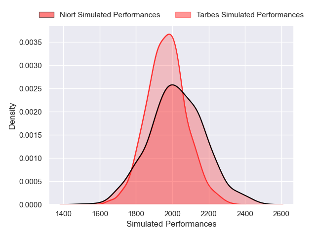
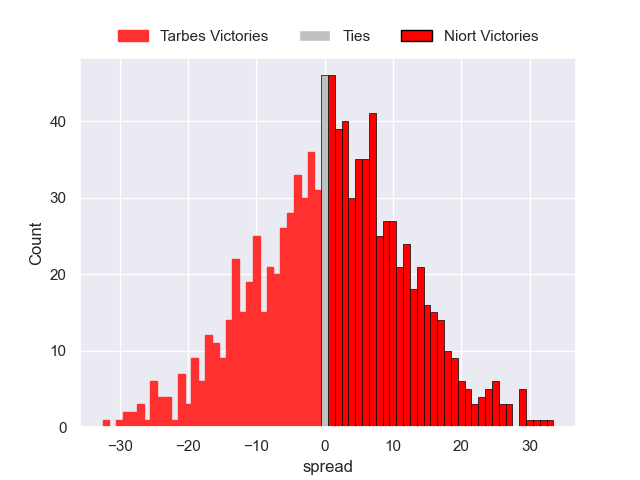

---  
layout: page  
title: Tarbes V Niort on 2025/10/31  
date: 2025-10-31  
categories: "Nationale 25/26" match projection  
---
# Tarbes V Niort on 2025/10/31, 15.0 to 20.0

# Club Level Predictions

Now that the game has been played, lets see how the club predictions did. I predicted Tarbes to win by 2.85, and Niort won by 5.0. That's an absolute error of 7.8 for the margin of victory, while my average absolute error has been 13.9 over the past six months. This prediction was more accurate than 60.9% of my recent predictions.

For the Over/Under model, I predicted a total of 42.5 and we have an actual total of 35.0. That's an absolute error of 7.5 compared to a six month average of 13.4. This prediction was more accurate than 65.1% of my recent predictions.
## Projected Performances - Club Model

## Projected Spreads - Club Model

## Projected Results - Club Model

