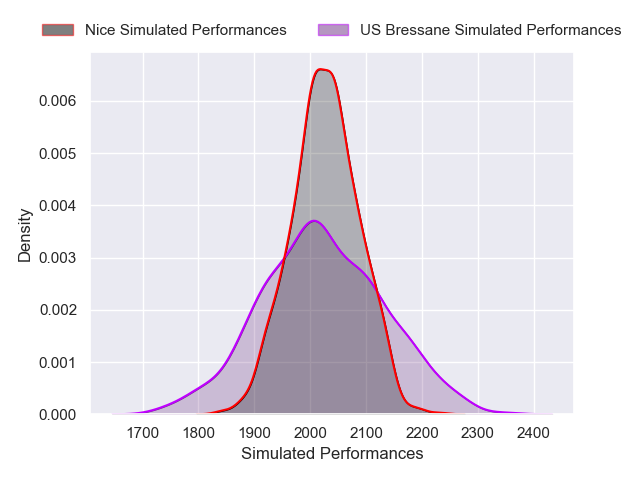
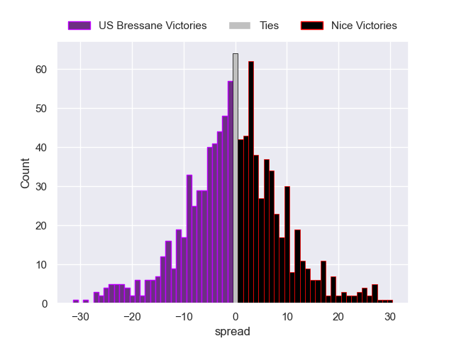

---  
layout: page  
title: US Bressane V Nice on 2025/10/31  
date: 2025-10-31  
categories: "Nationale 25/26" match projection  
---
# US Bressane V Nice on 2025/10/31, 35.0 to 24.0

# Club Level Predictions

Now that the game has been played, lets see how the club predictions did. I predicted US Bressane to win by 0.91, and US Bressane won by 11.0. That's an absolute error of 10.1 for the margin of victory, while my average absolute error has been 13.9 over the past six months. This prediction was more accurate than 50.6% of my recent predictions.

For the Over/Under model, I predicted a total of 41.5 and we have an actual total of 59.0. That's an absolute error of 17.5 compared to a six month average of 13.4. This prediction was more accurate than 28.9% of my recent predictions.
## Projected Performances - Club Model

## Projected Spreads - Club Model

## Projected Results - Club Model

