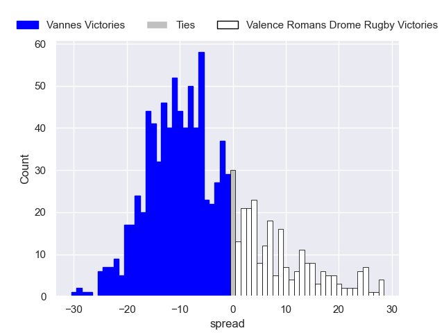

---  
layout: page  
title: Vannes V Valence Romans Drome Rugby on 2025/10/31  
date: 2025-10-31  
categories: "Pro D2 25/26" match projection  
---
# Vannes V Valence Romans Drome Rugby on 2025/10/31, 64.0 to 10.0

# Club Level Predictions

Now that the game has been played, lets see how the club predictions did. I predicted Vannes to win by 6.26, and Vannes won by 54.0. That's an absolute error of 47.7 for the margin of victory, while my average absolute error has been 13.9 over the past six months. This prediction was more accurate than 2.2% of my recent predictions.

For the Over/Under model, I predicted a total of 48.5 and we have an actual total of 74.0. That's an absolute error of 25.5 compared to a six month average of 13.4. This prediction was more accurate than 13.3% of my recent predictions.
## Projected Performances - Club Model

## Projected Spreads - Club Model

## Projected Results - Club Model

