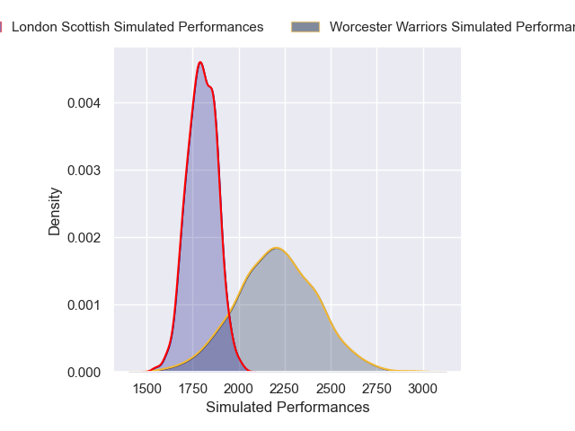
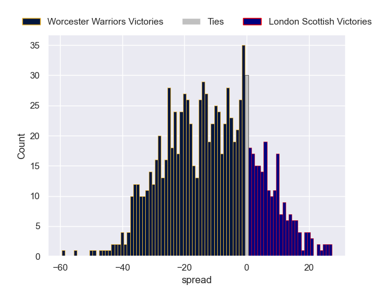

---  
layout: page  
title: Worcester Warriors V London Scottish on 2025/10/31  
date: 2025-10-31  
categories: "RFU Championship 25/26" match projection  
---
# Worcester Warriors V London Scottish on 2025/10/31, 52.0 to 19.0

# Club Level Predictions

Now that the game has been played, lets see how the club predictions did. I predicted Worcester Warriors to win by 10.8, and Worcester Warriors won by 33.0. That's an absolute error of 22.2 for the margin of victory, while my average absolute error has been 13.9 over the past six months. This prediction was more accurate than 20.0% of my recent predictions.

For the Over/Under model, I predicted a total of 57.5 and we have an actual total of 71.0. That's an absolute error of 13.5 compared to a six month average of 13.5. This prediction was more accurate than 41.0% of my recent predictions.
## Projected Performances - Club Model

## Projected Spreads - Club Model

## Projected Results - Club Model

