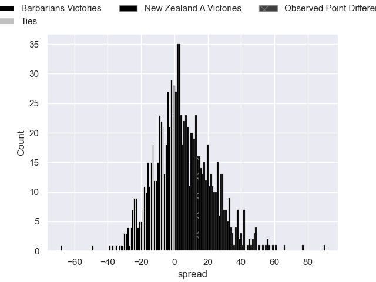

---  
layout: page  
title: Barbarians V New Zealand A on 2025/11/01  
date: 2025-11-01  
categories: "International Test Match 2025" match projection  
---
# Barbarians V New Zealand A on 2025/11/01, 19.0 to 33.0

# Club Level Predictions

Now that the game has been played, lets see how the club predictions did. I predicted New Zealand A to win by 5.06, and New Zealand A won by 14.0. That's an absolute error of 8.9 for the margin of victory, while my average absolute error has been 13.9 over the past six months. This prediction was more accurate than 54.9% of my recent predictions.

For the Over/Under model, I predicted a total of 51.5 and we have an actual total of 52.0. That's an absolute error of 0.5 compared to a six month average of 13.5. This prediction was more accurate than 97.0% of my recent predictions.
## Projected Performances - Club Model

## Projected Spreads - Club Model

## Projected Results - Club Model

