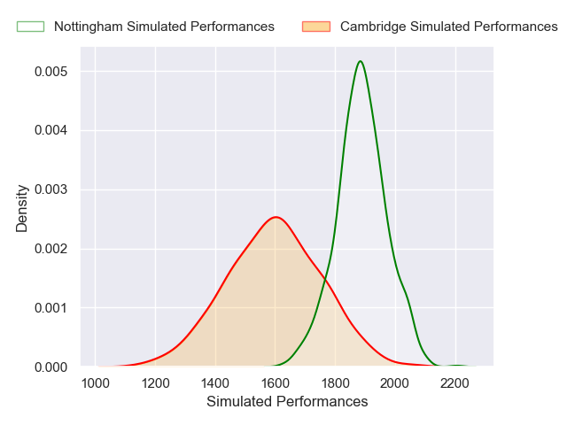
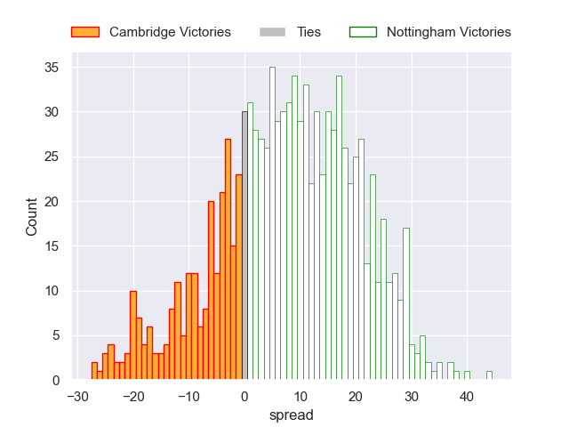

---  
layout: page  
title: Cambridge V Nottingham on 2025/11/01  
date: 2025-11-01  
categories: "RFU Championship 25/26" match projection  
---
# Cambridge V Nottingham on 2025/11/01, 32.0 to 36.0

# Club Level Predictions

Now that the game has been played, lets see how the club predictions did. I predicted Nottingham to win by 7.74, and Nottingham won by 4.0. That's an absolute error of 3.7 for the margin of victory, while my average absolute error has been 13.9 over the past six months. This prediction was more accurate than 80.9% of my recent predictions.

For the Over/Under model, I predicted a total of 77.5 and we have an actual total of 68.0. That's an absolute error of 9.5 compared to a six month average of 13.4. This prediction was more accurate than 55.9% of my recent predictions.
## Projected Performances - Club Model

## Projected Spreads - Club Model

## Projected Results - Club Model

