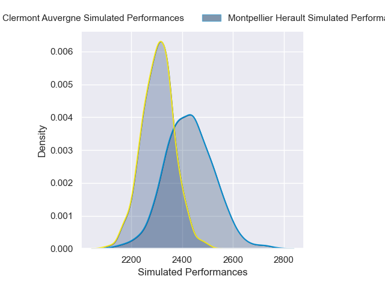
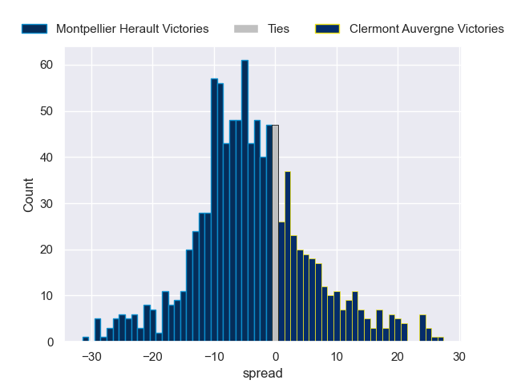

---  
layout: page  
title: Montpellier Herault V Clermont Auvergne on 2025/11/01  
date: 2025-11-01  
categories: "Top 14 25/26" match projection  
---
# Montpellier Herault V Clermont Auvergne on 2025/11/01, 7.0 to 9.0

# Club Level Predictions

Now that the game has been played, lets see how the club predictions did. I predicted Montpellier Herault to win by 3.55, and Clermont Auvergne won by 2.0. That's an absolute error of 5.6 for the margin of victory, while my average absolute error has been 13.9 over the past six months. This prediction was more accurate than 71.9% of my recent predictions.

For the Over/Under model, I predicted a total of 49.5 and we have an actual total of 16.0. That's an absolute error of 33.5 compared to a six month average of 13.4. This prediction was more accurate than 4.6% of my recent predictions.
## Projected Performances - Club Model

## Projected Spreads - Club Model

## Projected Results - Club Model

