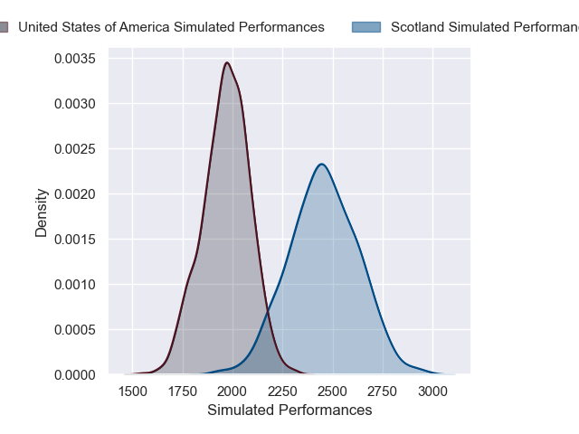
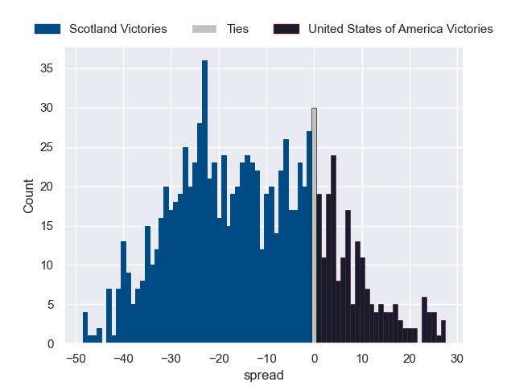

---  
layout: page  
title: Scotland V United States of America on 2025/11/01  
date: 2025-11-01  
categories: "International Test Match 2025" match projection  
---
# Scotland V United States of America on 2025/11/01, 85.0 to 0.0

# Club Level Predictions

Now that the game has been played, lets see how the club predictions did. I predicted Scotland to win by 12.95, and Scotland won by 85.0. That's an absolute error of 72.0 for the margin of victory, while my average absolute error has been 13.9 over the past six months. This prediction was more accurate than 0.4% of my recent predictions.

For the Over/Under model, I predicted a total of 52.5 and we have an actual total of 85.0. That's an absolute error of 32.5 compared to a six month average of 13.4. This prediction was more accurate than 5.0% of my recent predictions.
## Projected Performances - Club Model

## Projected Spreads - Club Model

## Projected Results - Club Model

