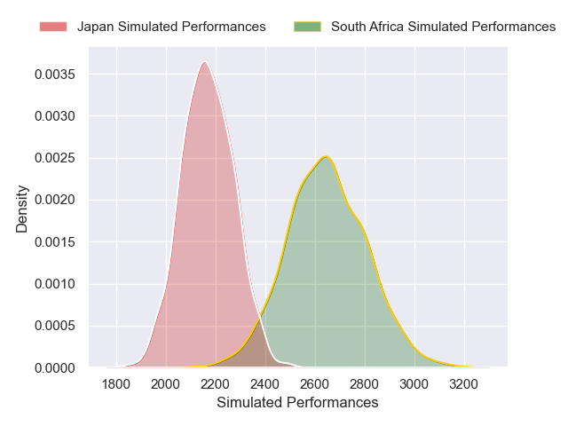
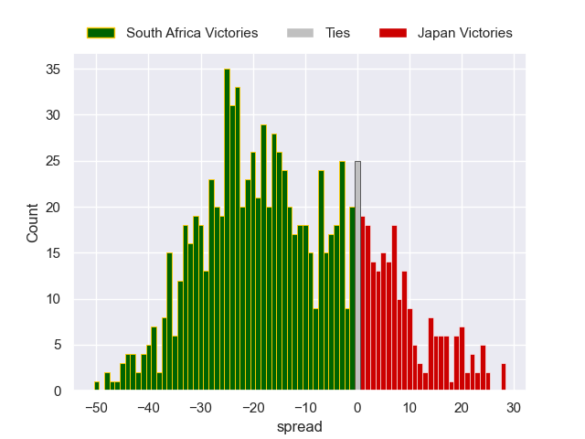

---  
layout: page  
title: South Africa V Japan on 2025/11/01  
date: 2025-11-01  
categories: "International Test Match 2025" match projection  
---
# South Africa V Japan on 2025/11/01, 61.0 to 7.0

# Club Level Predictions

Now that the game has been played, lets see how the club predictions did. I predicted South Africa to win by 12.92, and South Africa won by 54.0. That's an absolute error of 41.1 for the margin of victory, while my average absolute error has been 13.9 over the past six months. This prediction was more accurate than 4.1% of my recent predictions.

For the Over/Under model, I predicted a total of 58.5 and we have an actual total of 68.0. That's an absolute error of 9.5 compared to a six month average of 13.4. This prediction was more accurate than 55.9% of my recent predictions.
## Projected Performances - Club Model

## Projected Spreads - Club Model

## Projected Results - Club Model

