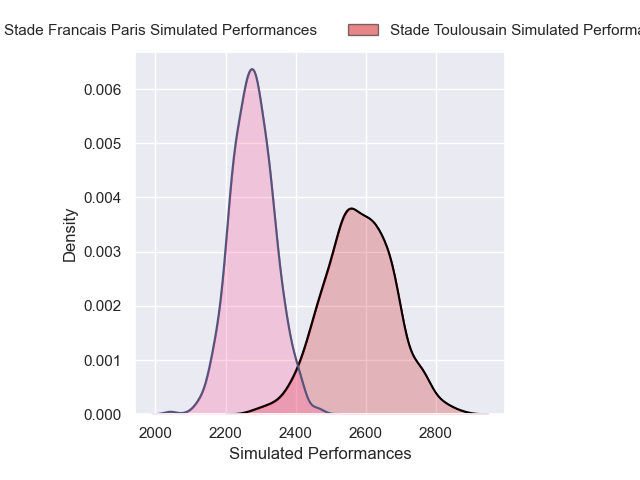
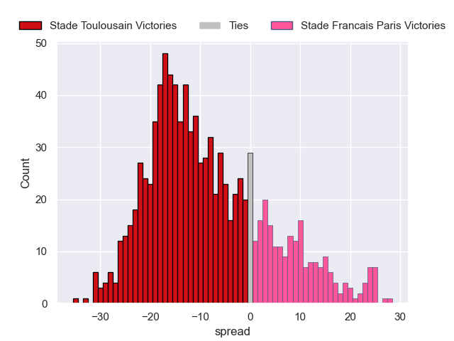

---  
layout: page  
title: Stade Toulousain V Stade Francais Paris on 2025/11/01  
date: 2025-11-01  
categories: "Top 14 25/26" match projection  
---
# Stade Toulousain V Stade Francais Paris on 2025/11/01, 29.0 to 17.0

# Club Level Predictions

Now that the game has been played, lets see how the club predictions did. I predicted Stade Toulousain to win by 8.29, and Stade Toulousain won by 12.0. That's an absolute error of 3.7 for the margin of victory, while my average absolute error has been 13.9 over the past six months. This prediction was more accurate than 81.0% of my recent predictions.

For the Over/Under model, I predicted a total of 51.5 and we have an actual total of 46.0. That's an absolute error of 5.5 compared to a six month average of 13.4. This prediction was more accurate than 73.8% of my recent predictions.
## Projected Performances - Club Model

## Projected Spreads - Club Model

## Projected Results - Club Model

