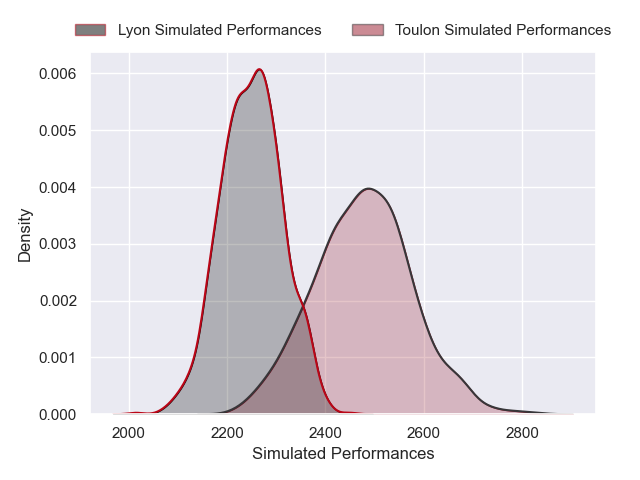
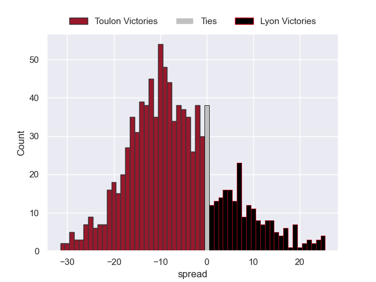

---  
layout: page  
title: Toulon V Lyon on 2025/11/01  
date: 2025-11-01  
categories: "Top 14 25/26" match projection  
---
# Toulon V Lyon on 2025/11/01, 54.0 to 21.0

# Club Level Predictions

Now that the game has been played, lets see how the club predictions did. I predicted Toulon to win by 6.36, and Toulon won by 33.0. That's an absolute error of 26.6 for the margin of victory, while my average absolute error has been 13.9 over the past six months. This prediction was more accurate than 13.5% of my recent predictions.

For the Over/Under model, I predicted a total of 53.5 and we have an actual total of 75.0. That's an absolute error of 21.5 compared to a six month average of 13.5. This prediction was more accurate than 19.6% of my recent predictions.
## Projected Performances - Club Model

## Projected Spreads - Club Model

## Projected Results - Club Model

