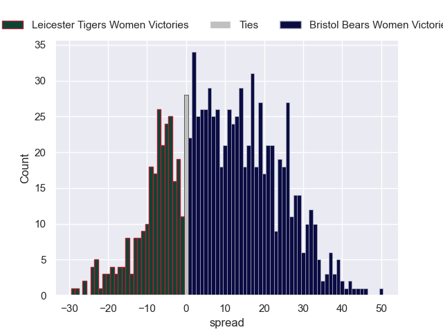

---  
layout: page  
title: Leicester Tigers Women V Bristol Bears Women on 2025/11/02  
date: 2025-11-02  
categories: "PWR 25/26" match projection  
---
# Leicester Tigers Women V Bristol Bears Women on 2025/11/02, 0.0 to 74.0

# Club Level Predictions

Now that the game has been played, lets see how the club predictions did. I predicted Bristol Bears Women to win by 8.79, and Bristol Bears Women won by 74.0. That's an absolute error of 65.2 for the margin of victory, while my average absolute error has been 13.9 over the past six months. This prediction was more accurate than 0.5% of my recent predictions.

For the Over/Under model, I predicted a total of 58.5 and we have an actual total of 74.0. That's an absolute error of 15.5 compared to a six month average of 13.4. This prediction was more accurate than 35.1% of my recent predictions.
## Projected Performances - Club Model

## Projected Spreads - Club Model

## Projected Results - Club Model

