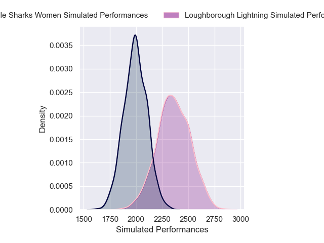
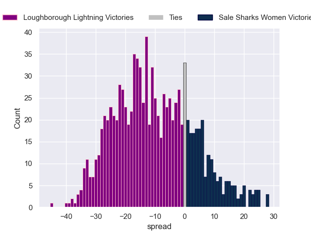

---  
layout: page  
title: Loughborough Lightning V Sale Sharks Women on 2025/11/02  
date: 2025-11-02  
categories: "PWR 25/26" match projection  
---
# Loughborough Lightning V Sale Sharks Women on 2025/11/02, 19.0 to 12.0

# Club Level Predictions

Now that the game has been played, lets see how the club predictions did. I predicted Loughborough Lightning to win by 10.59, and Loughborough Lightning won by 7.0. That's an absolute error of 3.6 for the margin of victory, while my average absolute error has been 13.9 over the past six months. This prediction was more accurate than 81.9% of my recent predictions.

For the Over/Under model, I predicted a total of 62.5 and we have an actual total of 31.0. That's an absolute error of 31.5 compared to a six month average of 13.4. This prediction was more accurate than 5.4% of my recent predictions.
## Projected Performances - Club Model

## Projected Spreads - Club Model

## Projected Results - Club Model

