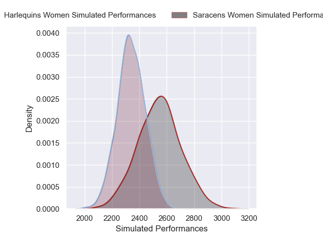
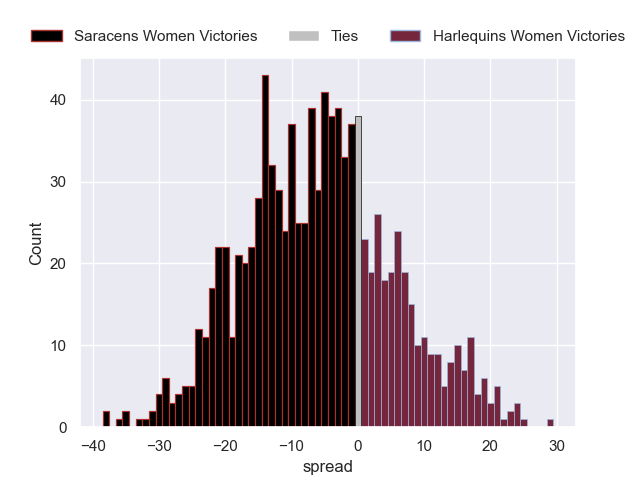

---  
layout: page  
title: Saracens Women V Harlequins Ladies on 2025/11/02  
date: 2025-11-02  
categories: "PWR 25/26" match projection  
---
# Saracens Women V Harlequins Ladies on 2025/11/02, 47.0 to 10.0

# Club Level Predictions

Now that the game has been played, lets see how the club predictions did. I predicted Saracens Women to win by 5.84, and Saracens Women won by 37.0. That's an absolute error of 31.2 for the margin of victory, while my average absolute error has been 13.9 over the past six months. This prediction was more accurate than 9.0% of my recent predictions.

For the Over/Under model, I predicted a total of 57.5 and we have an actual total of 57.0. That's an absolute error of 0.5 compared to a six month average of 13.4. This prediction was more accurate than 97.3% of my recent predictions.
## Projected Performances - Club Model

## Projected Spreads - Club Model

## Projected Results - Club Model

