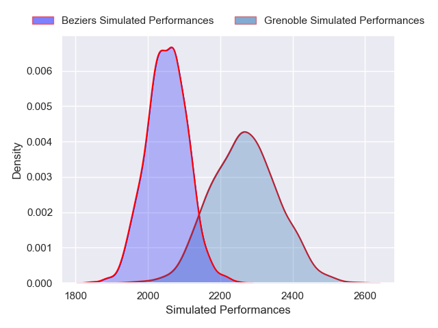
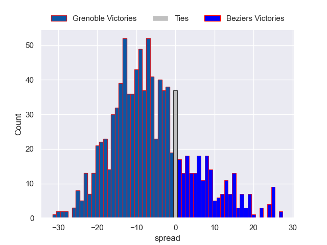

---  
layout: page  
title: Grenoble V Beziers on 2025/11/06  
date: 2025-11-06  
categories: "Pro D2 25/26" match projection  
---
# Grenoble V Beziers on 2025/11/06, 23.0 to 8.0

# Club Level Predictions

Now that the game has been played, lets see how the club predictions did. I predicted Grenoble to win by 6.67, and Grenoble won by 15.0. That's an absolute error of 8.3 for the margin of victory, while my average absolute error has been 13.8 over the past six months. This prediction was more accurate than 58.4% of my recent predictions.

For the Over/Under model, I predicted a total of 50.5 and we have an actual total of 31.0. That's an absolute error of 19.5 compared to a six month average of 13.2. This prediction was more accurate than 24.5% of my recent predictions.
## Projected Performances - Club Model

## Projected Spreads - Club Model

## Projected Results - Club Model

