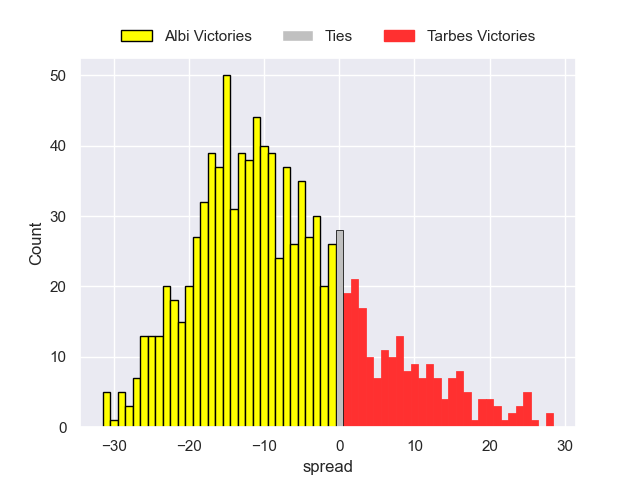
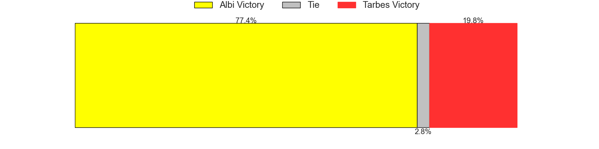

---  
layout: page  
title: Albi V Tarbes on 2025/11/07  
date: 2025-11-07  
categories: "Nationale 25/26" match projection  
---
# Albi V Tarbes on 2025/11/07, 35.0 to 13.0

# Club Level Predictions

Now that the game has been played, lets see how the club predictions did. I predicted Albi to win by 7.75, and Albi won by 22.0. That's an absolute error of 14.2 for the margin of victory, while my average absolute error has been 13.7 over the past six months. This prediction was more accurate than 36.1% of my recent predictions.

For the Over/Under model, I predicted a total of 43.5 and we have an actual total of 48.0. That's an absolute error of 4.5 compared to a six month average of 13.4. This prediction was more accurate than 79.7% of my recent predictions.
## Projected Performances - Club Model

## Projected Spreads - Club Model

## Projected Results - Club Model

