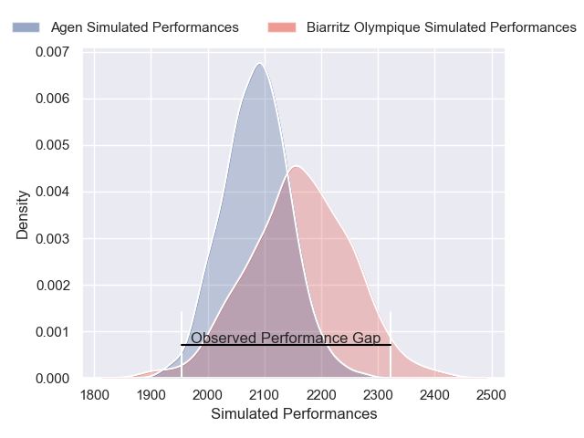
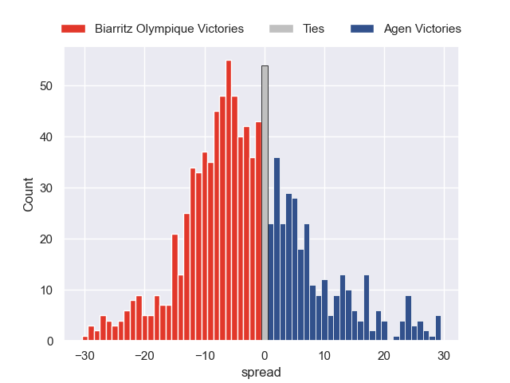

---  
layout: page  
title: Biarritz Olympique V Agen on 2025/11/07  
date: 2025-11-07  
categories: "Pro D2 25/26" match projection  
---
# Biarritz Olympique V Agen on 2025/11/07, 33.0 to 16.0

# Club Level Predictions

Now that the game has been played, lets see how the club predictions did. I predicted Biarritz Olympique to win by 2.29, and Biarritz Olympique won by 17.0. That's an absolute error of 14.7 for the margin of victory, while my average absolute error has been 13.7 over the past six months. This prediction was more accurate than 35.2% of my recent predictions.

For the Over/Under model, I predicted a total of 44.5 and we have an actual total of 49.0. That's an absolute error of 4.5 compared to a six month average of 13.4. This prediction was more accurate than 79.7% of my recent predictions.
## Projected Performances - Club Model

## Projected Spreads - Club Model

## Projected Results - Club Model

