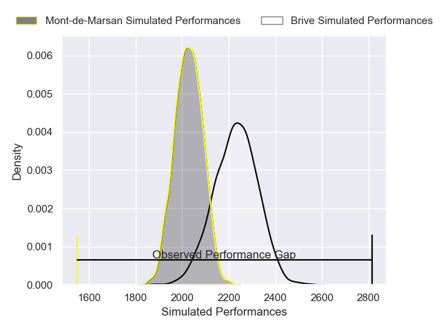
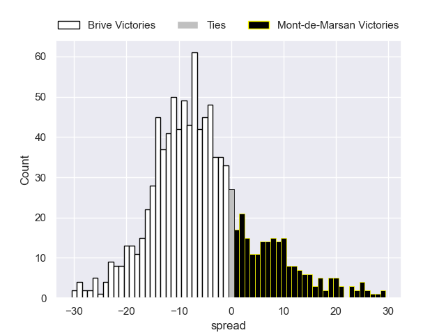
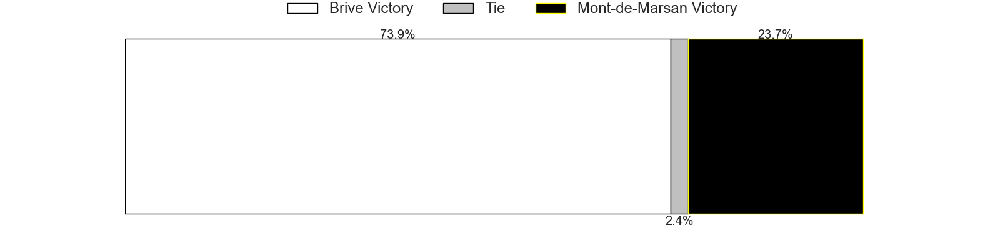

---  
layout: page  
title: Brive V Mont-de-Marsan on 2025/11/07  
date: 2025-11-07  
categories: "Pro D2 25/26" match projection  
---
# Brive V Mont-de-Marsan on 2025/11/07, 68.0 to 10.0

# Club Level Predictions

Now that the game has been played, lets see how the club predictions did. I predicted Brive to win by 5.28, and Brive won by 58.0. That's an absolute error of 52.7 for the margin of victory, while my average absolute error has been 13.8 over the past six months. This prediction was more accurate than 1.6% of my recent predictions.

For the Over/Under model, I predicted a total of 47.5 and we have an actual total of 78.0. That's an absolute error of 30.5 compared to a six month average of 13.2. This prediction was more accurate than 6.0% of my recent predictions.
## Projected Performances - Club Model

## Projected Spreads - Club Model

## Projected Results - Club Model

