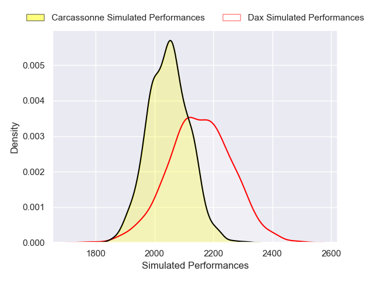
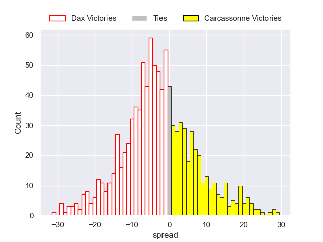
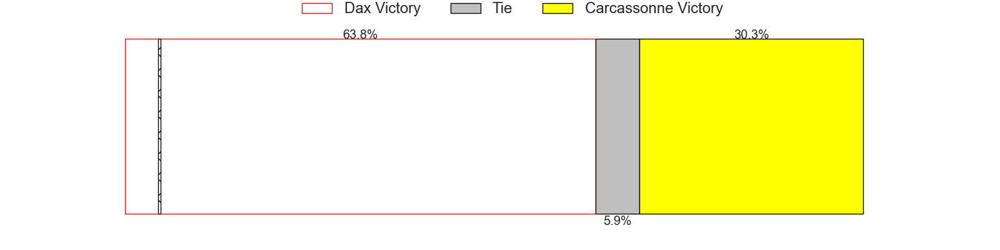

---  
layout: page  
title: Dax V Carcassonne on 2025/11/07  
date: 2025-11-07  
categories: "Pro D2 25/26" match projection  
---
# Dax V Carcassonne on 2025/11/07, 19.0 to 0.0

# Club Level Predictions

Now that the game has been played, lets see how the club predictions did. I predicted Dax to win by 3.02, and Dax won by 19.0. That's an absolute error of 16.0 for the margin of victory, while my average absolute error has been 13.7 over the past six months. This prediction was more accurate than 31.5% of my recent predictions.

For the Over/Under model, I predicted a total of 43.5 and we have an actual total of 19.0. That's an absolute error of 24.5 compared to a six month average of 13.2. This prediction was more accurate than 14.2% of my recent predictions.
## Projected Performances - Club Model

## Projected Spreads - Club Model

## Projected Results - Club Model

