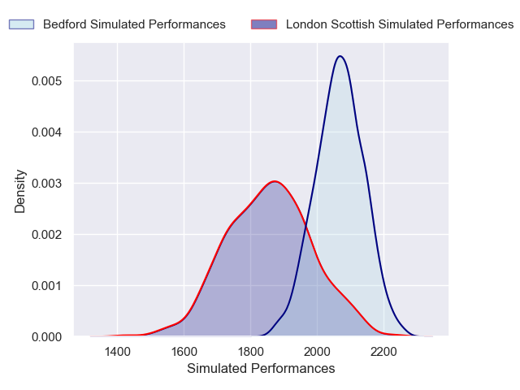
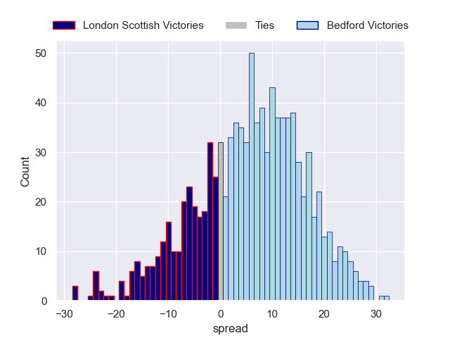

---  
layout: page  
title: London Scottish V Bedford on 2025/11/07  
date: 2025-11-07  
categories: "RFU Championship 25/26" match projection  
---
# London Scottish V Bedford on 2025/11/07, 7.0 to 26.0

# Club Level Predictions

Now that the game has been played, lets see how the club predictions did. I predicted Bedford to win by 6.09, and Bedford won by 19.0. That's an absolute error of 12.9 for the margin of victory, while my average absolute error has been 13.7 over the past six months. This prediction was more accurate than 39.6% of my recent predictions.

For the Over/Under model, I predicted a total of 62.5 and we have an actual total of 33.0. That's an absolute error of 29.5 compared to a six month average of 13.4. This prediction was more accurate than 7.9% of my recent predictions.
## Projected Performances - Club Model

## Projected Spreads - Club Model

## Projected Results - Club Model

