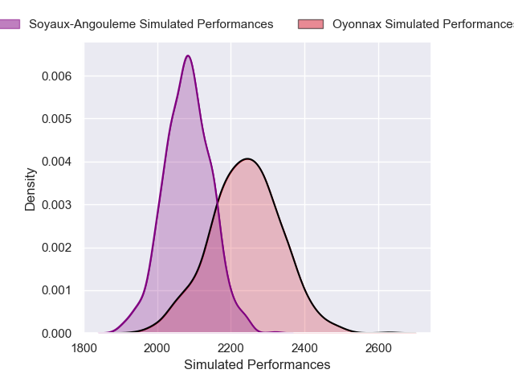
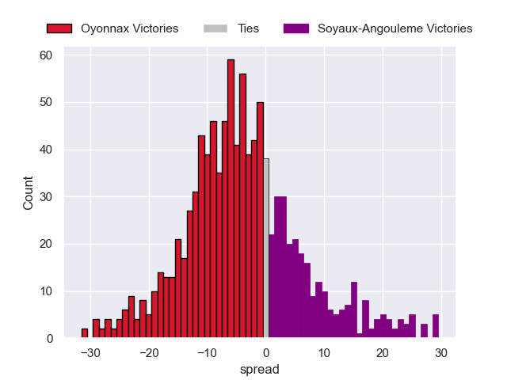
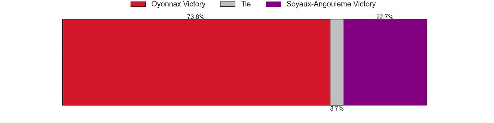

---  
layout: page  
title: Oyonnax V Soyaux-Angouleme on 2025/11/07  
date: 2025-11-07  
categories: "Pro D2 25/26" match projection  
---
# Oyonnax V Soyaux-Angouleme on 2025/11/07, 50.0 to 21.0

# Club Level Predictions

Now that the game has been played, lets see how the club predictions did. I predicted Oyonnax to win by 5.2, and Oyonnax won by 29.0. That's an absolute error of 23.8 for the margin of victory, while my average absolute error has been 13.7 over the past six months. This prediction was more accurate than 16.6% of my recent predictions.

For the Over/Under model, I predicted a total of 46.5 and we have an actual total of 71.0. That's an absolute error of 24.5 compared to a six month average of 13.4. This prediction was more accurate than 14.8% of my recent predictions.
## Projected Performances - Club Model

## Projected Spreads - Club Model

## Projected Results - Club Model

