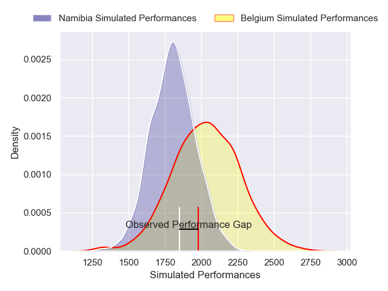
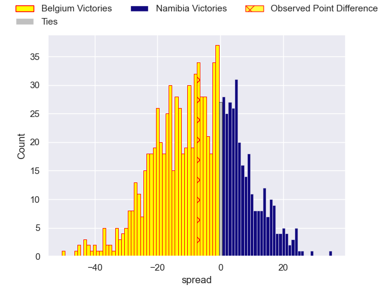
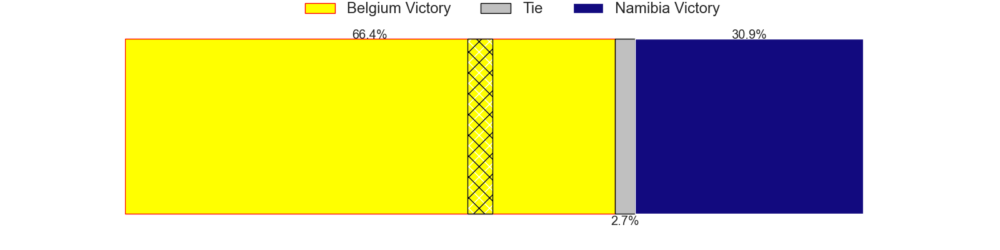

---  
layout: page  
title: Belgium V Namibia on 2025/11/08  
date: 2025-11-08  
categories: "Rugby World Cup 2027 Final Qualification Tournament 2025" match projection  
---
# Belgium V Namibia on 2025/11/08, 22.0 to 15.0

# Club Level Predictions

Now that the game has been played, lets see how the club predictions did. I predicted Belgium to win by 6.77, and Belgium won by 7.0. That's an absolute error of 0.2 for the margin of victory, while my average absolute error has been 13.7 over the past six months. This prediction was more accurate than 98.3% of my recent predictions.

For the Over/Under model, I predicted a total of 48.5 and we have an actual total of 37.0. That's an absolute error of 11.5 compared to a six month average of 13.4. This prediction was more accurate than 47.6% of my recent predictions.
## Projected Performances - Club Model

## Projected Spreads - Club Model

## Projected Results - Club Model

