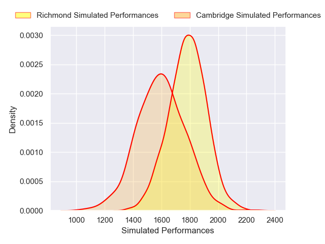
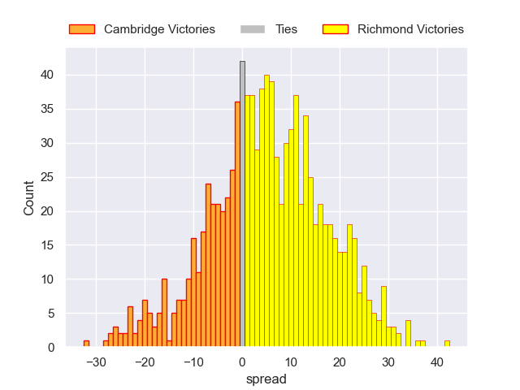

---  
layout: page  
title: Cambridge V Richmond on 2025/11/08  
date: 2025-11-08  
categories: "RFU Championship 25/26" match projection  
---
# Cambridge V Richmond on 2025/11/08, 5.0 to 54.0

# Club Level Predictions

Now that the game has been played, lets see how the club predictions did. I predicted Richmond to win by 5.05, and Richmond won by 49.0. That's an absolute error of 44.0 for the margin of victory, while my average absolute error has been 13.8 over the past six months. This prediction was more accurate than 3.2% of my recent predictions.

For the Over/Under model, I predicted a total of 65.5 and we have an actual total of 59.0. That's an absolute error of 6.5 compared to a six month average of 13.2. This prediction was more accurate than 69.1% of my recent predictions.
## Projected Performances - Club Model

## Projected Spreads - Club Model

## Projected Results - Club Model

