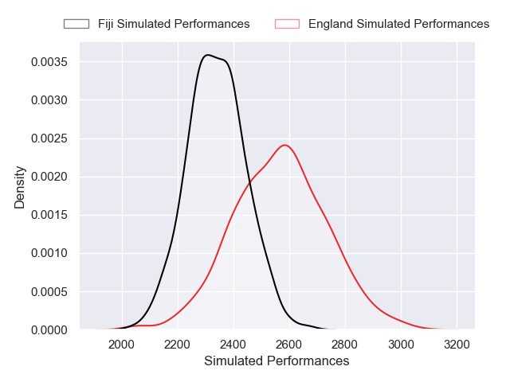
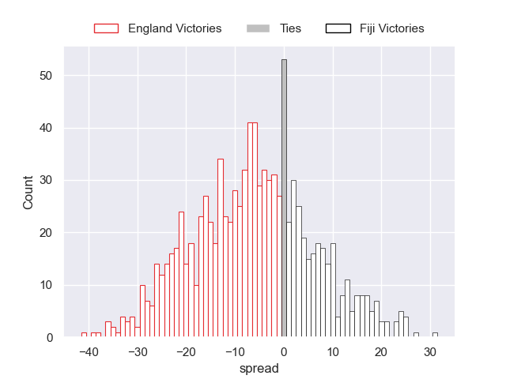

---  
layout: page  
title: England V Fiji on 2025/11/08  
date: 2025-11-08  
categories: "International Test Match 2025" match projection  
---
# England V Fiji on 2025/11/08, 38.0 to 18.0

# Club Level Predictions

Now that the game has been played, lets see how the club predictions did. I predicted England to win by 6.62, and England won by 20.0. That's an absolute error of 13.4 for the margin of victory, while my average absolute error has been 13.7 over the past six months. This prediction was more accurate than 37.5% of my recent predictions.

For the Over/Under model, I predicted a total of 49.5 and we have an actual total of 56.0. That's an absolute error of 6.5 compared to a six month average of 13.2. This prediction was more accurate than 69.3% of my recent predictions.
## Projected Performances - Club Model

## Projected Spreads - Club Model

## Projected Results - Club Model

