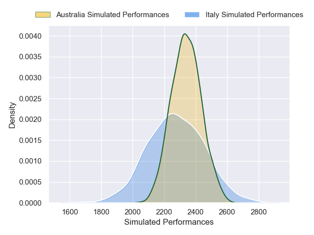
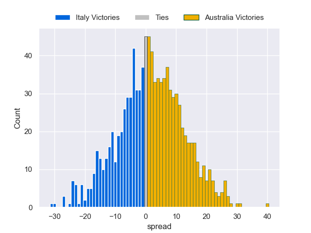

---  
layout: page  
title: Italy V Australia on 2025/11/08  
date: 2025-11-08  
categories: "International Test Match 2025" match projection  
---
# Italy V Australia on 2025/11/08, 26.0 to 19.0

# Club Level Predictions

Now that the game has been played, lets see how the club predictions did. I predicted Australia to win by 1.87, and Italy won by 7.0. That's an absolute error of 8.9 for the margin of victory, while my average absolute error has been 13.7 over the past six months. This prediction was more accurate than 54.2% of my recent predictions.

For the Over/Under model, I predicted a total of 54.5 and we have an actual total of 45.0. That's an absolute error of 9.5 compared to a six month average of 13.4. This prediction was more accurate than 55.5% of my recent predictions.
## Projected Performances - Club Model

## Projected Spreads - Club Model

## Projected Results - Club Model

