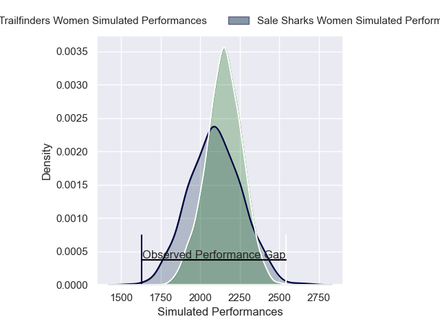
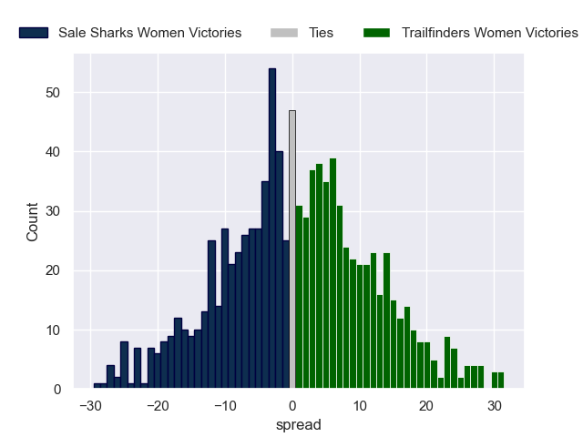

---  
layout: page  
title: Sale Sharks Women V Trailfinders Women on 2025/11/08  
date: 2025-11-08  
categories: "PWR 25/26" match projection  
---
# Sale Sharks Women V Trailfinders Women on 2025/11/08, 22.0 to 64.0

# Club Level Predictions

Now that the game has been played, lets see how the club predictions did. I predicted Trailfinders Women to win by 2.15, and Trailfinders Women won by 42.0. That's an absolute error of 39.8 for the margin of victory, while my average absolute error has been 13.7 over the past six months. This prediction was more accurate than 4.9% of my recent predictions.

For the Over/Under model, I predicted a total of 55.5 and we have an actual total of 86.0. That's an absolute error of 30.5 compared to a six month average of 13.2. This prediction was more accurate than 6.5% of my recent predictions.
## Projected Performances - Club Model

## Projected Spreads - Club Model

## Projected Results - Club Model

