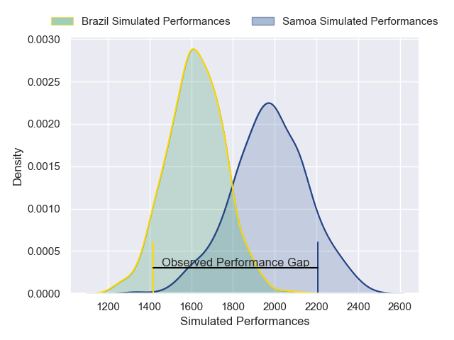
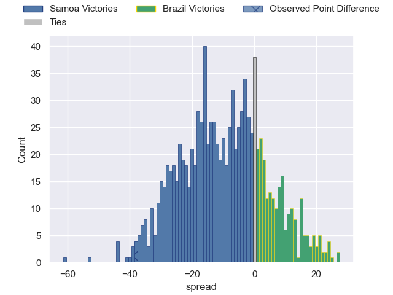
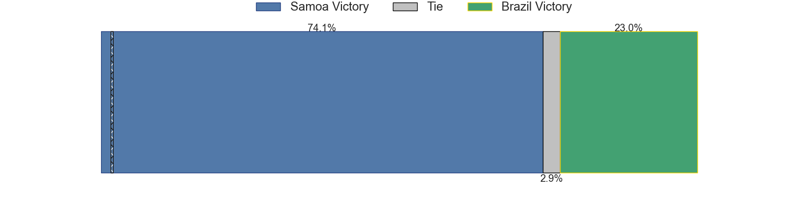

---  
layout: page  
title: Samoa V Brazil on 2025/11/08  
date: 2025-11-08  
categories: "Rugby World Cup 2027 Final Qualification Tournament 2025" match projection  
---
# Samoa V Brazil on 2025/11/08, 48.0 to 10.0

# Club Level Predictions

Now that the game has been played, lets see how the club predictions did. I predicted Samoa to win by 9.86, and Samoa won by 38.0. That's an absolute error of 28.1 for the margin of victory, while my average absolute error has been 13.7 over the past six months. This prediction was more accurate than 11.7% of my recent predictions.

For the Over/Under model, I predicted a total of 52.5 and we have an actual total of 58.0. That's an absolute error of 5.5 compared to a six month average of 13.4. This prediction was more accurate than 74.4% of my recent predictions.
## Projected Performances - Club Model

## Projected Spreads - Club Model

## Projected Results - Club Model

