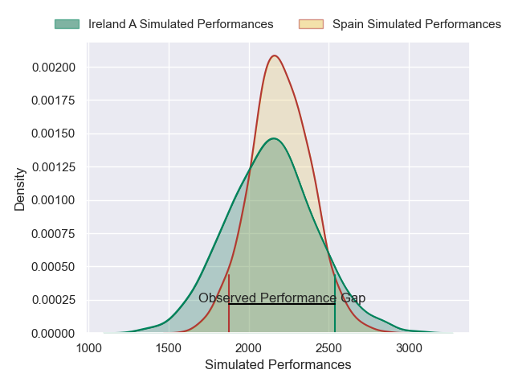
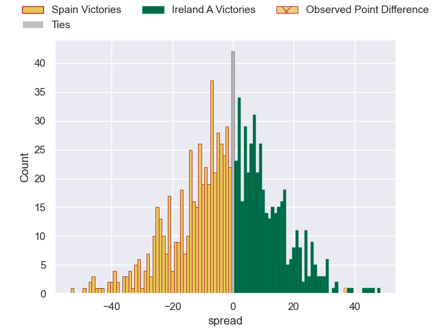

---  
layout: page  
title: Spain V Ireland A on 2025/11/08  
date: 2025-11-08  
categories: "Test Matchs 2025" match projection  
---
# Spain V Ireland A on 2025/11/08, 24.0 to 61.0

# Club Level Predictions

Now that the game has been played, lets see how the club predictions did. I predicted Spain to win by 1.97, and Ireland A won by 37.0. That's an absolute error of 39.0 for the margin of victory, while my average absolute error has been 13.7 over the past six months. This prediction was more accurate than 5.5% of my recent predictions.

For the Over/Under model, I predicted a total of 53.5 and we have an actual total of 85.0. That's an absolute error of 31.5 compared to a six month average of 13.2. This prediction was more accurate than 5.1% of my recent predictions.
## Projected Performances - Club Model

## Projected Spreads - Club Model

## Projected Results - Club Model

