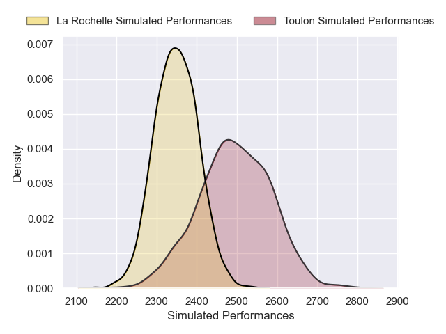
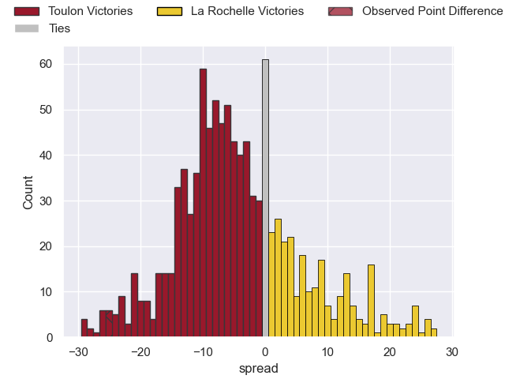
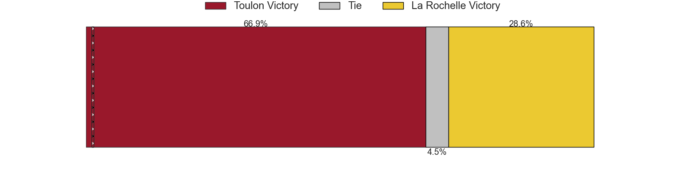

---  
layout: page  
title: Toulon V La Rochelle on 2025/11/08  
date: 2025-11-08  
categories: "Top 14 25/26" match projection  
---
# Toulon V La Rochelle on 2025/11/08, 39.0 to 14.0

# Club Level Predictions

Now that the game has been played, lets see how the club predictions did. I predicted Toulon to win by 4.29, and Toulon won by 25.0. That's an absolute error of 20.7 for the margin of victory, while my average absolute error has been 13.7 over the past six months. This prediction was more accurate than 21.5% of my recent predictions.

For the Over/Under model, I predicted a total of 49.5 and we have an actual total of 53.0. That's an absolute error of 3.5 compared to a six month average of 13.2. This prediction was more accurate than 84.3% of my recent predictions.
## Projected Performances - Club Model

## Projected Spreads - Club Model

## Projected Results - Club Model

