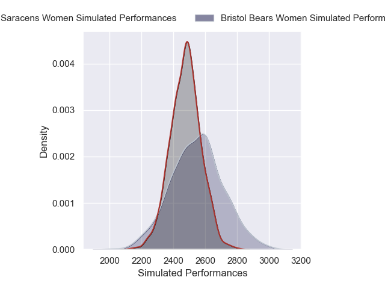
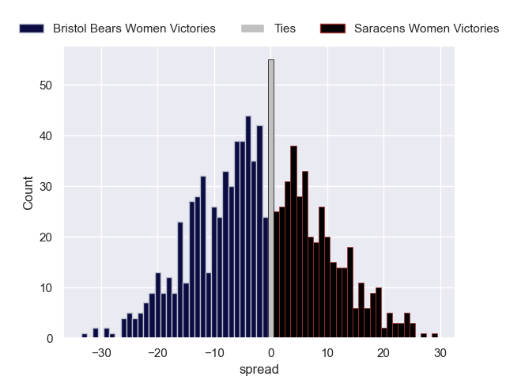

---  
layout: page  
title: Bristol Bears Women V Saracens Women on 2025/11/09  
date: 2025-11-09  
categories: "PWR 25/26" match projection  
---
# Bristol Bears Women V Saracens Women on 2025/11/09, 12.0 to 33.0

# Club Level Predictions

Now that the game has been played, lets see how the club predictions did. I predicted Bristol Bears Women to win by 2.28, and Saracens Women won by 21.0. That's an absolute error of 23.3 for the margin of victory, while my average absolute error has been 13.8 over the past six months. This prediction was more accurate than 17.9% of my recent predictions.

For the Over/Under model, I predicted a total of 57.5 and we have an actual total of 45.0. That's an absolute error of 12.5 compared to a six month average of 13.2. This prediction was more accurate than 44.2% of my recent predictions.
## Projected Performances - Club Model

## Projected Spreads - Club Model

## Projected Results - Club Model

