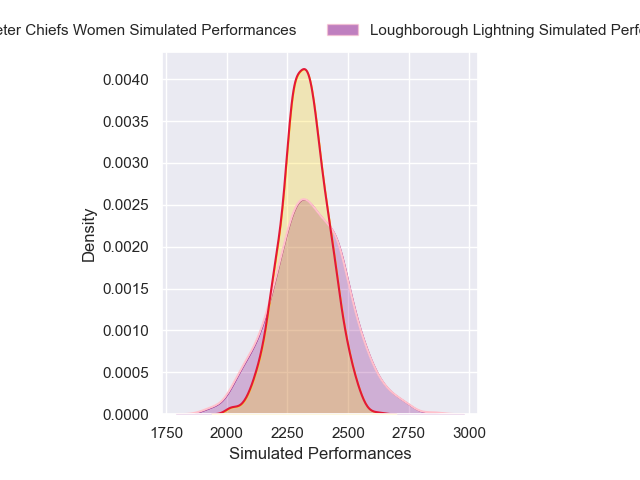
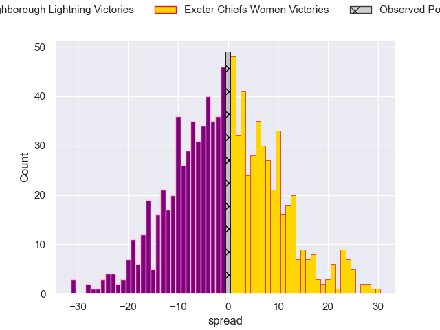

---  
layout: page  
title: Loughborough Lightning V Exeter Chiefs Women on 2025/11/09  
date: 2025-11-09  
categories: "PWR 25/26" match projection  
---
# Loughborough Lightning V Exeter Chiefs Women on 2025/11/09, 33.0 to 33.0

# Club Level Predictions

Now that the game has been played, lets see how the club predictions did. I predicted Loughborough Lightning to win by 0.85, and Exeter Chiefs Women won by 0.0. That's an absolute error of 0.8 for the margin of victory, while my average absolute error has been 13.8 over the past six months. This prediction was more accurate than 95.1% of my recent predictions.

For the Over/Under model, I predicted a total of 54.5 and we have an actual total of 66.0. That's an absolute error of 11.5 compared to a six month average of 13.2. This prediction was more accurate than 47.9% of my recent predictions.
## Projected Performances - Club Model

## Projected Spreads - Club Model

## Projected Results - Club Model

