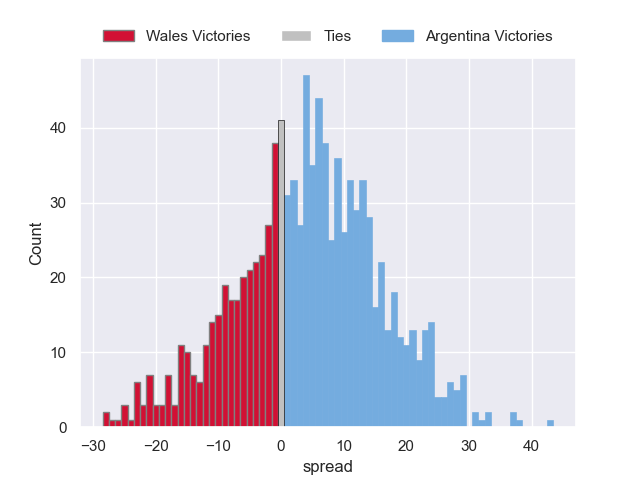

---  
layout: page  
title: Wales V Argentina on 2025/11/09  
date: 2025-11-09  
categories: "International Test Match 2025" match projection  
---
# Wales V Argentina on 2025/11/09, 28.0 to 52.0

# Club Level Predictions

Now that the game has been played, lets see how the club predictions did. I predicted Argentina to win by 4.24, and Argentina won by 24.0. That's an absolute error of 19.8 for the margin of victory, while my average absolute error has been 13.7 over the past six months. This prediction was more accurate than 24.0% of my recent predictions.

For the Over/Under model, I predicted a total of 60.5 and we have an actual total of 80.0. That's an absolute error of 19.5 compared to a six month average of 13.4. This prediction was more accurate than 24.8% of my recent predictions.
## Projected Performances - Club Model

## Projected Spreads - Club Model

## Projected Results - Club Model

