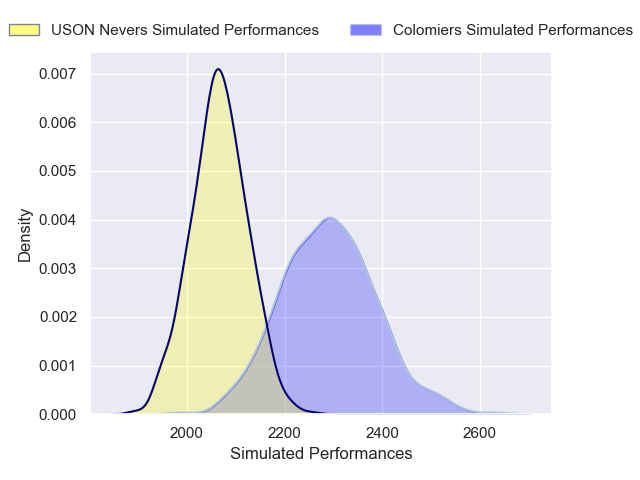
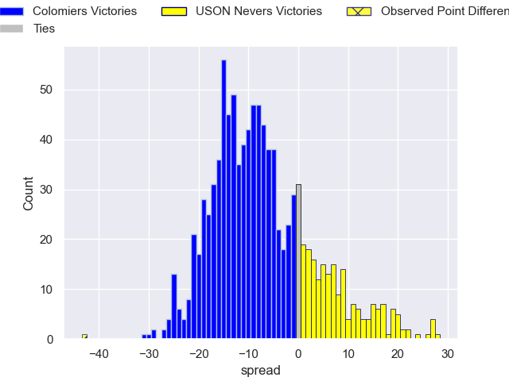

---  
layout: page  
title: Colomiers V USON Nevers on 2025/11/14  
date: 2025-11-14  
categories: "Pro D2 25/26" match projection  
---
# Colomiers V USON Nevers on 2025/11/14, 49.0 to 6.0

# Club Level Predictions

Now that the game has been played, lets see how the club predictions did. I predicted Colomiers to win by 7.62, and Colomiers won by 43.0. That's an absolute error of 35.4 for the margin of victory, while my average absolute error has been 13.8 over the past six months. This prediction was more accurate than 6.3% of my recent predictions.

For the Over/Under model, I predicted a total of 48.5 and we have an actual total of 55.0. That's an absolute error of 6.5 compared to a six month average of 13.2. This prediction was more accurate than 68.8% of my recent predictions.
## Projected Performances - Club Model

## Projected Spreads - Club Model

## Projected Results - Club Model

