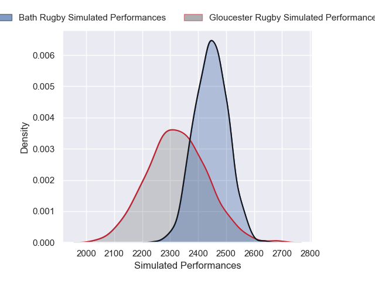
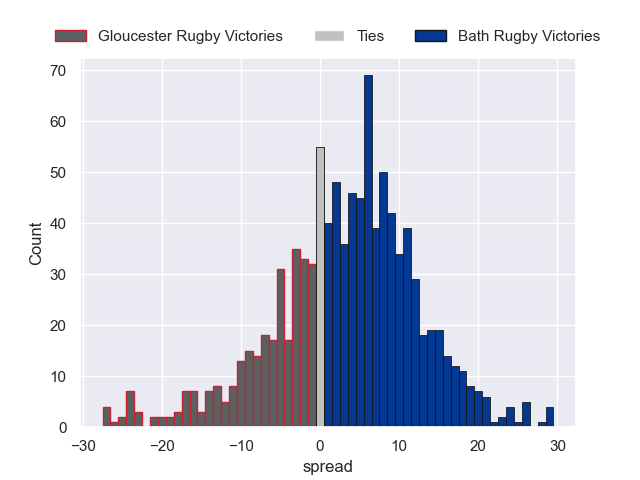

---  
layout: page  
title: Gloucester Rugby V Bath Rugby on 2025/11/14  
date: 2025-11-14  
categories: "Premiership Rugby Cup 25/26" match projection  
---
# Gloucester Rugby V Bath Rugby on 2025/11/14, 19.0 to 17.0

# Club Level Predictions

Now that the game has been played, lets see how the club predictions did. I predicted Bath Rugby to win by 4.45, and Gloucester Rugby won by 2.0. That's an absolute error of 6.4 for the margin of victory, while my average absolute error has been 13.8 over the past six months. This prediction was more accurate than 67.6% of my recent predictions.

For the Over/Under model, I predicted a total of 58.5 and we have an actual total of 36.0. That's an absolute error of 22.5 compared to a six month average of 13.2. This prediction was more accurate than 17.2% of my recent predictions.
## Projected Performances - Club Model

## Projected Spreads - Club Model

## Projected Results - Club Model

