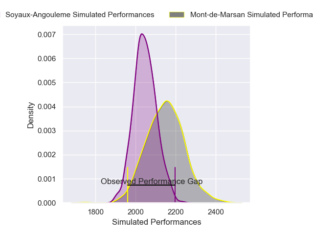
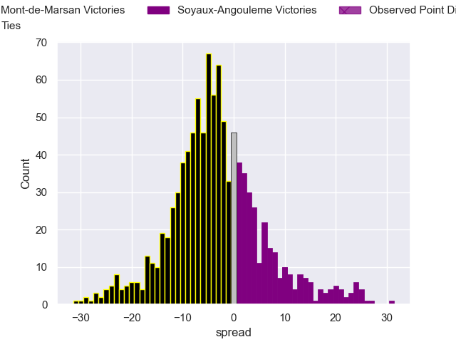
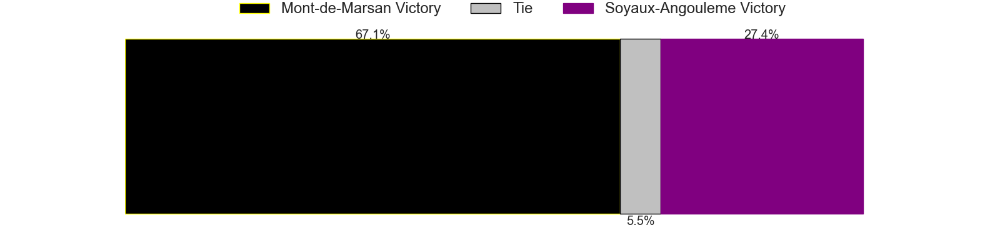

---  
layout: page  
title: Mont-de-Marsan V Soyaux-Angouleme on 2025/11/14  
date: 2025-11-14  
categories: "Pro D2 25/26" match projection  
---
# Mont-de-Marsan V Soyaux-Angouleme on 2025/11/14, 6.0 to 16.0

# Club Level Predictions

Now that the game has been played, lets see how the club predictions did. I predicted Mont-de-Marsan to win by 3.4, and Soyaux-Angouleme won by 10.0. That's an absolute error of 13.4 for the margin of victory, while my average absolute error has been 13.8 over the past six months. This prediction was more accurate than 38.4% of my recent predictions.

For the Over/Under model, I predicted a total of 52.5 and we have an actual total of 22.0. That's an absolute error of 30.5 compared to a six month average of 13.0. This prediction was more accurate than 6.1% of my recent predictions.
## Projected Performances - Club Model

## Projected Spreads - Club Model

## Projected Results - Club Model

