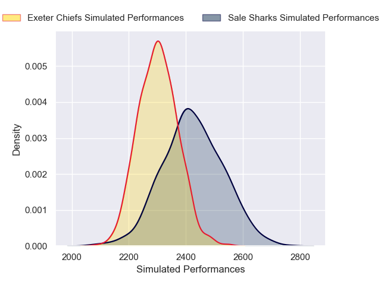
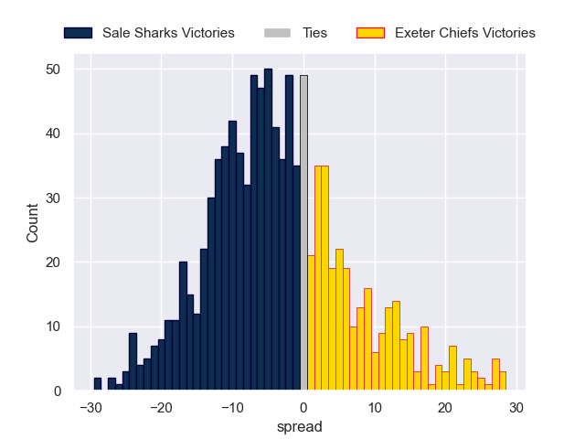

---  
layout: page  
title: Sale Sharks V Exeter Chiefs on 2025/11/14  
date: 2025-11-14  
categories: "Premiership Rugby Cup 25/26" match projection  
---
# Sale Sharks V Exeter Chiefs on 2025/11/14, 34.0 to 3.0

# Club Level Predictions

Now that the game has been played, lets see how the club predictions did. I predicted Sale Sharks to win by 4.2, and Sale Sharks won by 31.0. That's an absolute error of 26.8 for the margin of victory, while my average absolute error has been 13.8 over the past six months. This prediction was more accurate than 13.3% of my recent predictions.

For the Over/Under model, I predicted a total of 54.5 and we have an actual total of 37.0. That's an absolute error of 17.5 compared to a six month average of 13.0. This prediction was more accurate than 27.3% of my recent predictions.
## Projected Performances - Club Model

## Projected Spreads - Club Model

## Projected Results - Club Model

