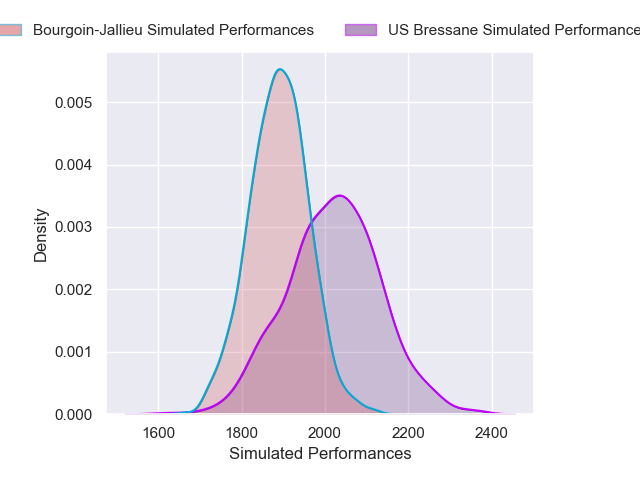
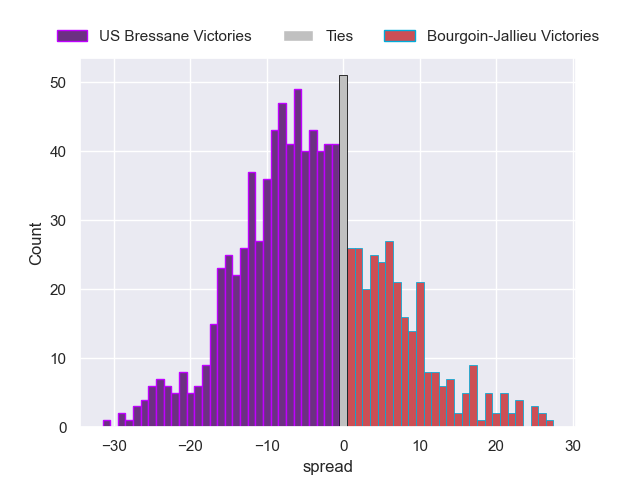

---  
layout: page  
title: US Bressane V Bourgoin-Jallieu on 2025/11/14  
date: 2025-11-14  
categories: "Nationale 25/26" match projection  
---
# US Bressane V Bourgoin-Jallieu on 2025/11/14, 24.0 to 3.0

# Club Level Predictions

Now that the game has been played, lets see how the club predictions did. I predicted US Bressane to win by 3.1, and US Bressane won by 21.0. That's an absolute error of 17.9 for the margin of victory, while my average absolute error has been 13.8 over the past six months. This prediction was more accurate than 28.3% of my recent predictions.

For the Over/Under model, I predicted a total of 43.5 and we have an actual total of 27.0. That's an absolute error of 16.5 compared to a six month average of 13.0. This prediction was more accurate than 29.9% of my recent predictions.
## Projected Performances - Club Model

## Projected Spreads - Club Model

## Projected Results - Club Model

