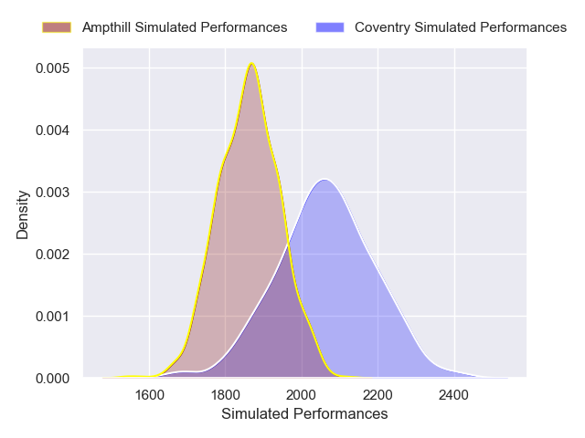
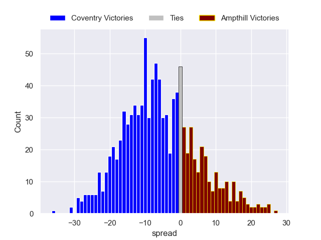

---  
layout: page  
title: Coventry V Ampthill on 2025/11/15  
date: 2025-11-15  
categories: "RFU Championship 25/26" match projection  
---
# Coventry V Ampthill on 2025/11/15, 68.0 to 26.0

# Club Level Predictions

Now that the game has been played, lets see how the club predictions did. I predicted Coventry to win by 5.58, and Coventry won by 42.0. That's an absolute error of 36.4 for the margin of victory, while my average absolute error has been 13.8 over the past six months. This prediction was more accurate than 5.9% of my recent predictions.

For the Over/Under model, I predicted a total of 60.5 and we have an actual total of 94.0. That's an absolute error of 33.5 compared to a six month average of 13.2. This prediction was more accurate than 4.5% of my recent predictions.
## Projected Performances - Club Model

## Projected Spreads - Club Model

## Projected Results - Club Model

