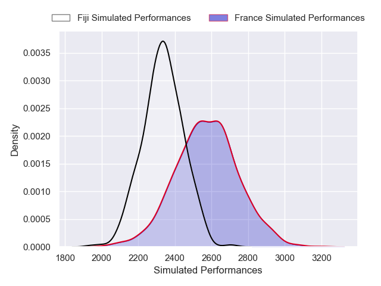
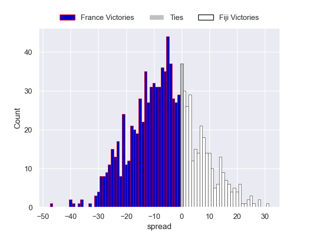
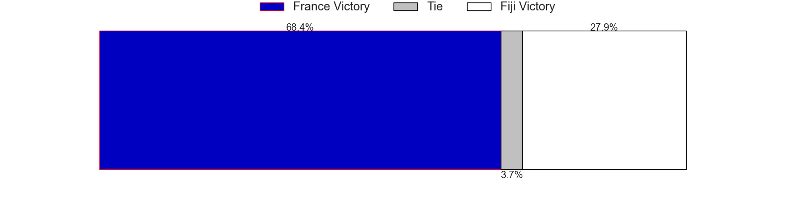

---  
layout: page  
title: France V Fiji on 2025/11/15  
date: 2025-11-15  
categories: "International Test Match 2025" match projection  
---
# France V Fiji on 2025/11/15, 34.0 to 21.0

# Club Level Predictions

Now that the game has been played, lets see how the club predictions did. I predicted France to win by 6.14, and France won by 13.0. That's an absolute error of 6.9 for the margin of victory, while my average absolute error has been 13.8 over the past six months. This prediction was more accurate than 65.0% of my recent predictions.

For the Over/Under model, I predicted a total of 53.5 and we have an actual total of 55.0. That's an absolute error of 1.5 compared to a six month average of 13.1. This prediction was more accurate than 92.2% of my recent predictions.
## Projected Performances - Club Model

## Projected Spreads - Club Model

## Projected Results - Club Model

