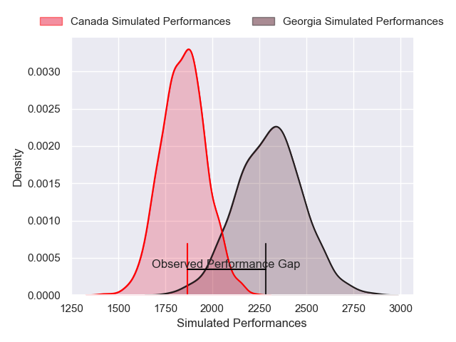
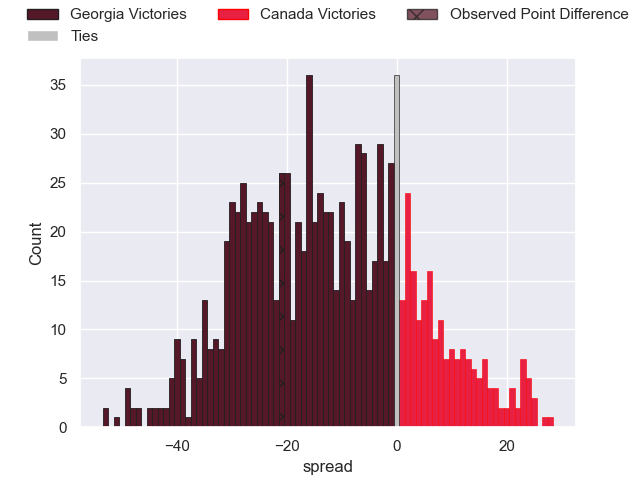

---  
layout: page  
title: Georgia V Canada on 2025/11/15  
date: 2025-11-15  
categories: "Test Matchs 2025" match projection  
---
# Georgia V Canada on 2025/11/15, 38.0 to 17.0

# Club Level Predictions

Now that the game has been played, lets see how the club predictions did. I predicted Georgia to win by 12.34, and Georgia won by 21.0. That's an absolute error of 8.7 for the margin of victory, while my average absolute error has been 13.8 over the past six months. This prediction was more accurate than 56.3% of my recent predictions.

For the Over/Under model, I predicted a total of 58.5 and we have an actual total of 55.0. That's an absolute error of 3.5 compared to a six month average of 13.2. This prediction was more accurate than 84.0% of my recent predictions.
## Projected Performances - Club Model

## Projected Spreads - Club Model

## Projected Results - Club Model

