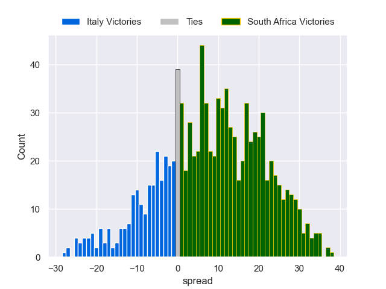

---  
layout: page  
title: Italy V South Africa on 2025/11/15  
date: 2025-11-15  
categories: "International Test Match 2025" match projection  
---
# Italy V South Africa on 2025/11/15, 14.0 to 32.0

# Club Level Predictions

Now that the game has been played, lets see how the club predictions did. I predicted South Africa to win by 7.35, and South Africa won by 18.0. That's an absolute error of 10.6 for the margin of victory, while my average absolute error has been 13.8 over the past six months. This prediction was more accurate than 48.6% of my recent predictions.

For the Over/Under model, I predicted a total of 69.5 and we have an actual total of 46.0. That's an absolute error of 23.5 compared to a six month average of 13.1. This prediction was more accurate than 16.2% of my recent predictions.
## Projected Performances - Club Model

## Projected Spreads - Club Model

## Projected Results - Club Model

