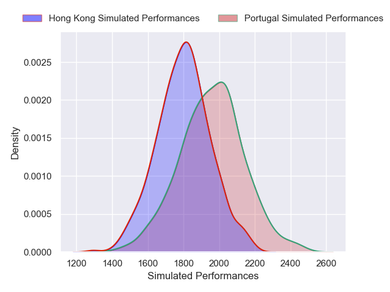
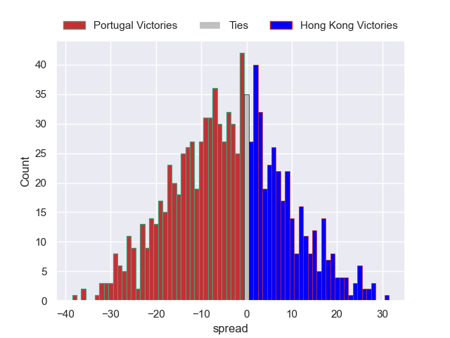

---  
layout: page  
title: Portugal V Hong Kong on 2025/11/15  
date: 2025-11-15  
categories: "Test Matchs 2025" match projection  
---
# Portugal V Hong Kong on 2025/11/15, 58.0 to 12.0

# Club Level Predictions

Now that the game has been played, lets see how the club predictions did. I predicted Portugal to win by 5.23, and Portugal won by 46.0. That's an absolute error of 40.8 for the margin of victory, while my average absolute error has been 13.8 over the past six months. This prediction was more accurate than 4.3% of my recent predictions.

For the Over/Under model, I predicted a total of 58.5 and we have an actual total of 70.0. That's an absolute error of 11.5 compared to a six month average of 13.1. This prediction was more accurate than 48.1% of my recent predictions.
## Projected Performances - Club Model

## Projected Spreads - Club Model

## Projected Results - Club Model

