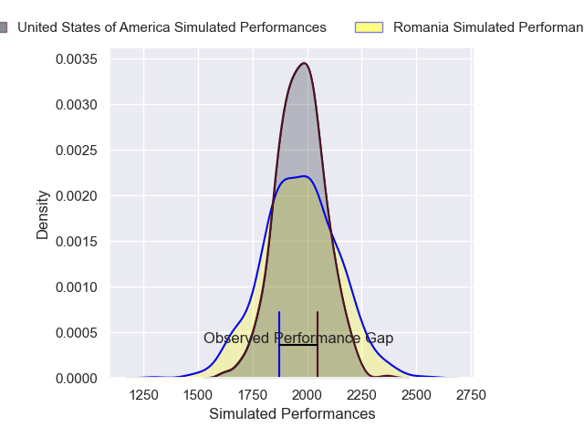
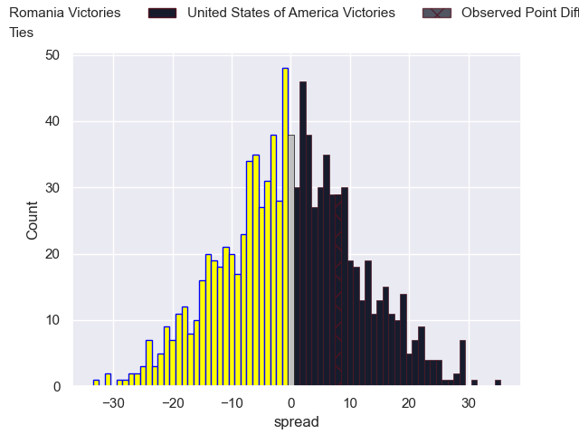

---  
layout: page  
title: Romania V United States of America on 2025/11/15  
date: 2025-11-15  
categories: "Test Matchs 2025" match projection  
---
# Romania V United States of America on 2025/11/15, 18.0 to 26.0

# Club Level Predictions

Now that the game has been played, lets see how the club predictions did. I predicted Romania to win by 0.71, and United States of America won by 8.0. That's an absolute error of 8.7 for the margin of victory, while my average absolute error has been 13.8 over the past six months. This prediction was more accurate than 56.5% of my recent predictions.

For the Over/Under model, I predicted a total of 57.5 and we have an actual total of 44.0. That's an absolute error of 13.5 compared to a six month average of 13.1. This prediction was more accurate than 39.3% of my recent predictions.
## Projected Performances - Club Model

## Projected Spreads - Club Model

## Projected Results - Club Model

