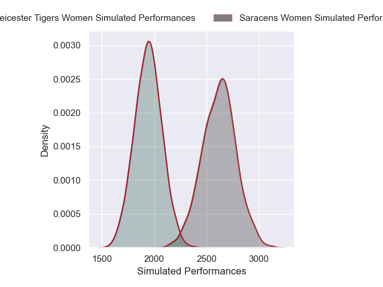
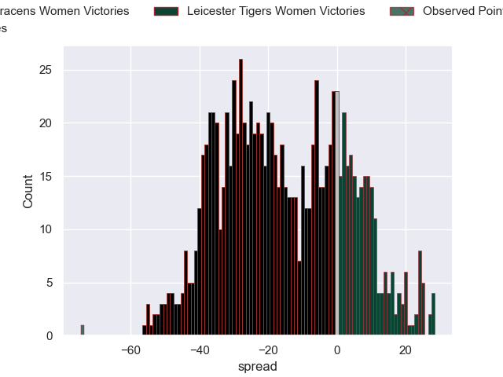

---  
layout: page  
title: Saracens Women V Leicester Tigers Women on 2025/11/15  
date: 2025-11-15  
categories: "PWR 25/26" match projection  
---
# Saracens Women V Leicester Tigers Women on 2025/11/15, 79.0 to 5.0

# Club Level Predictions

Now that the game has been played, lets see how the club predictions did. I predicted Saracens Women to win by 15.31, and Saracens Women won by 74.0. That's an absolute error of 58.7 for the margin of victory, while my average absolute error has been 13.8 over the past six months. This prediction was more accurate than 0.7% of my recent predictions.

For the Over/Under model, I predicted a total of 65.5 and we have an actual total of 84.0. That's an absolute error of 18.5 compared to a six month average of 13.2. This prediction was more accurate than 25.9% of my recent predictions.
## Projected Performances - Club Model

## Projected Spreads - Club Model

## Projected Results - Club Model

