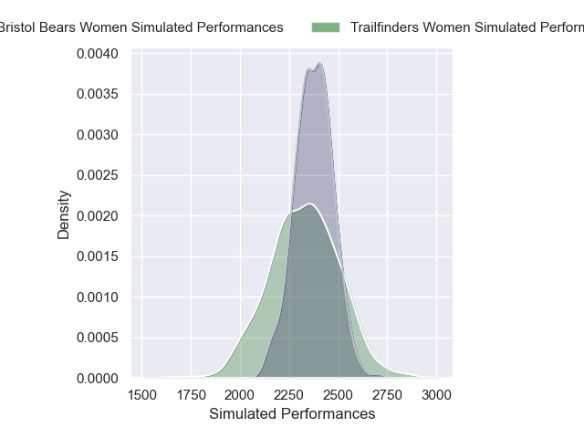
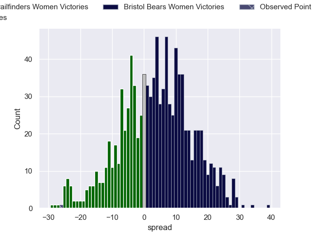

---  
layout: page  
title: Trailfinders Women V Bristol Bears Women on 2025/11/15  
date: 2025-11-15  
categories: "PWR 25/26" match projection  
---
# Trailfinders Women V Bristol Bears Women on 2025/11/15, 45.0 to 19.0

# Club Level Predictions

Now that the game has been played, lets see how the club predictions did. I predicted Bristol Bears Women to win by 3.79, and Trailfinders Women won by 26.0. That's an absolute error of 29.8 for the margin of victory, while my average absolute error has been 13.8 over the past six months. This prediction was more accurate than 10.8% of my recent predictions.

For the Over/Under model, I predicted a total of 56.5 and we have an actual total of 64.0. That's an absolute error of 7.5 compared to a six month average of 13.2. This prediction was more accurate than 63.5% of my recent predictions.
## Projected Performances - Club Model

## Projected Spreads - Club Model

## Projected Results - Club Model

