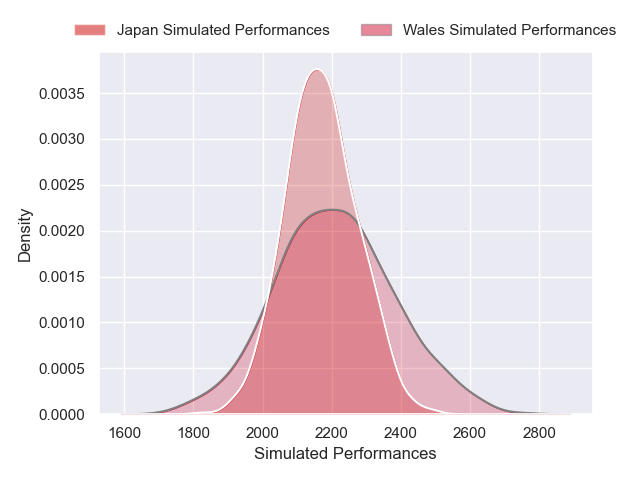
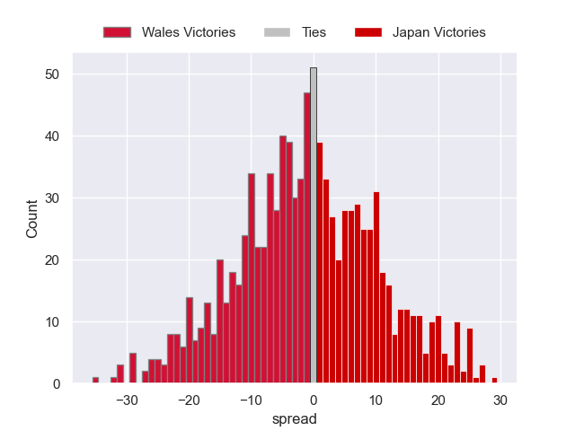

---  
layout: page  
title: Wales V Japan on 2025/11/15  
date: 2025-11-15  
categories: "International Test Match 2025" match projection  
---
# Wales V Japan on 2025/11/15, 24.0 to 23.0

# Club Level Predictions

Now that the game has been played, lets see how the club predictions did. I predicted Wales to win by 1.58, and Wales won by 1.0. That's an absolute error of 0.6 for the margin of victory, while my average absolute error has been 13.8 over the past six months. This prediction was more accurate than 96.9% of my recent predictions.

For the Over/Under model, I predicted a total of 57.5 and we have an actual total of 47.0. That's an absolute error of 10.5 compared to a six month average of 13.1. This prediction was more accurate than 50.6% of my recent predictions.
## Projected Performances - Club Model

## Projected Spreads - Club Model

## Projected Results - Club Model

