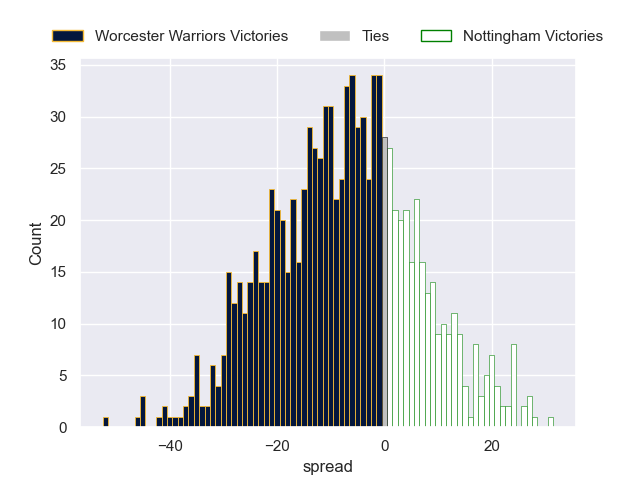

---  
layout: page  
title: Worcester Warriors V Nottingham on 2025/11/15  
date: 2025-11-15  
categories: "RFU Championship 25/26" match projection  
---
# Worcester Warriors V Nottingham on 2025/11/15, 24.0 to 22.0

# Club Level Predictions

Now that the game has been played, lets see how the club predictions did. I predicted Worcester Warriors to win by 7.95, and Worcester Warriors won by 2.0. That's an absolute error of 6.0 for the margin of victory, while my average absolute error has been 13.8 over the past six months. This prediction was more accurate than 69.4% of my recent predictions.

For the Over/Under model, I predicted a total of 59.5 and we have an actual total of 46.0. That's an absolute error of 13.5 compared to a six month average of 13.0. This prediction was more accurate than 39.2% of my recent predictions.
## Projected Performances - Club Model

## Projected Spreads - Club Model

## Projected Results - Club Model

