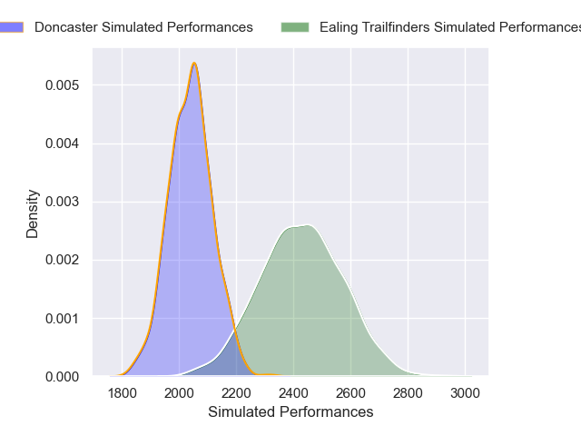
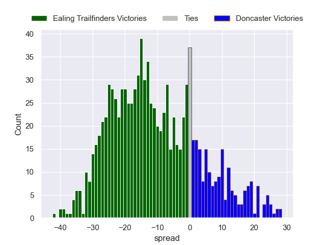

---  
layout: page  
title: Ealing Trailfinders V Doncaster on 2025/11/16  
date: 2025-11-16  
categories: "RFU Championship 25/26" match projection  
---
# Ealing Trailfinders V Doncaster on 2025/11/16, 35.0 to 21.0

# Club Level Predictions

Now that the game has been played, lets see how the club predictions did. I predicted Ealing Trailfinders to win by 11.24, and Ealing Trailfinders won by 14.0. That's an absolute error of 2.8 for the margin of victory, while my average absolute error has been 13.8 over the past six months. This prediction was more accurate than 85.8% of my recent predictions.

For the Over/Under model, I predicted a total of 55.5 and we have an actual total of 56.0. That's an absolute error of 0.5 compared to a six month average of 13.0. This prediction was more accurate than 97.8% of my recent predictions.
## Projected Performances - Club Model

## Projected Spreads - Club Model

## Projected Results - Club Model

